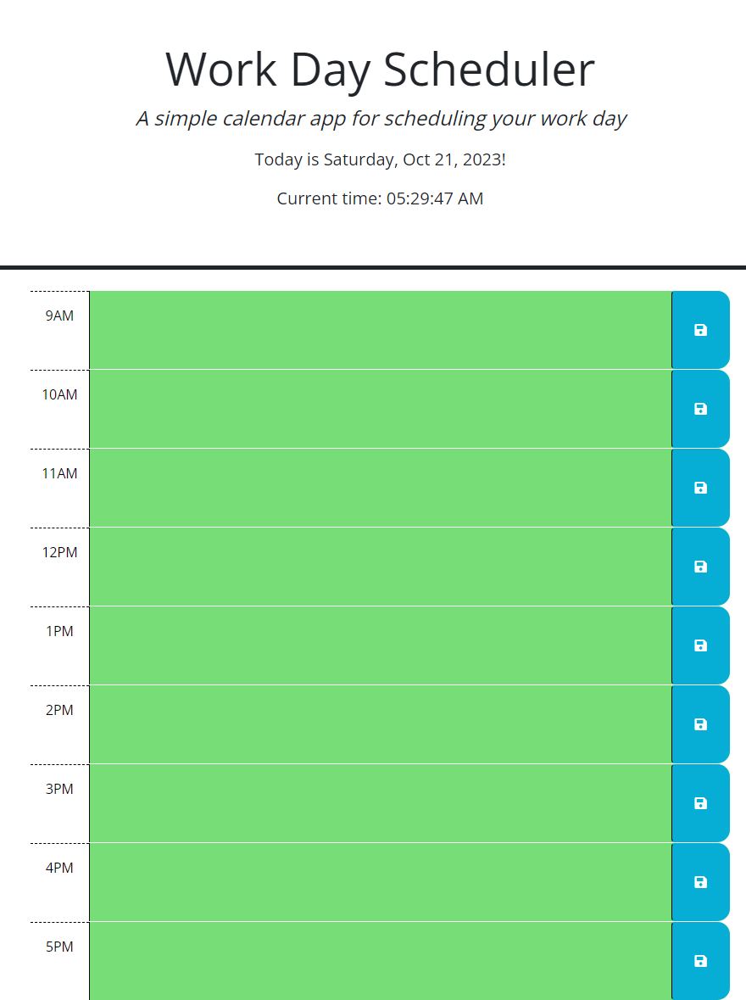

# Hourly_Work_Calendar

## Description

This readme contains information on the Hourly Work Day Calendar website. The website incorporates the use of CSS, HTML, and Javascript. The link to the deployed live site can be found in the "Links" section of this readme. All buttons in the deployed website are functioning properly and the date and time are also displayed on the webpage. 

## Installation

N/A

## Usage

In order to use this website, the user must fill in the sections and click the save button to store the information. The information will be stored until the user decides to delete the information.

## Links

Github repository URL: https://github.com/JarettDeSanti/Hourly_Work_Calendar  
Deployed live site URL: https://jarettdesanti.github.io/Hourly_Work_Calendar/

## Screenshot

## Acknowledgements

## Credits

N/A

## License

Please refer to the LICENSE in the repository.

## Badges
N/A

## Features
N/A

## How to Contribute
N/A

## Tests
N/A